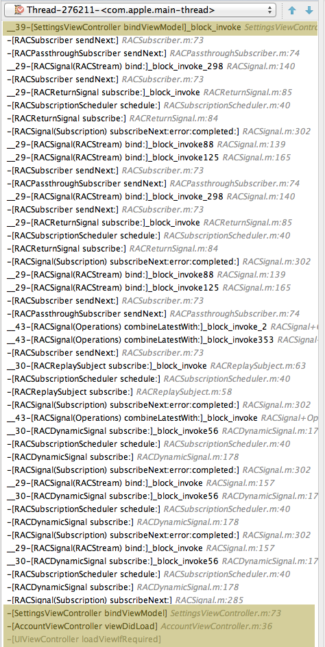

# (Functional) Reactive Programming

# with ReactiveCocoa

### Florent Pillet

###[fpillet@gmail.com](mailto:fpillet@gmail.com)<br><br>[@fpillet](twitter:fpillet)

---
# _Reactive_ programming?

--- 

## Reactive programming is essentially<br>working with<br>**asynchronous data streams**

^ 1997: Microsoft Research developed the FRAN language (Functional Reactive ANimation). Other specialized languages like Esterel are functional / reactive.

^ Model everything (events, data received or produced, state transitions) as data flow

--- 

## **Data** changes over **time** and flows in **streams** processed with an asynchronous, operator-based **logic**.

---
## They are all **separate**, yet usually found at the same place in the code.

^ Logic expressed quasi-linearly

^ Flow, data and logic expressed separately, but usually at the same place in code.

^ Transformation stages nicely lined up make for easy to understand processing logic

--- 

## Build modern, highly interactive, dynamic applications

#### with minimal pain.

---

## Learning curve is **steep**[^1]

### Need to let go of imperative habits, learn new abstractions and patterns

### but...

[^1]: If you read only one, it should be [The introduction to reactive programming you've been missing](https://gist.github.com/staltz/868e7e9bc2a7b8c1f754)

^ Figuring out the usefulness of some abstract conceps not easy

^ Stepping up from imperative programming requires an involved learning strategy


---
## **Pays off big time**

## Modular

## Reusable

## Expressive

## Testable code


---
## Reactive programming paves the way to **eliminating state and mutability** from your code.[^2]

[^2]: Suggested reading: [Enemy of the state](https://speakerdeck.com/jspahrsummers/enemy-of-the-state) presentation by Justin Sparh-Summmers.

^ State and mutability are major sources of complexity and unpredictability


---
## So what does this reactive thing look like?


---
# **Signals**

^ Fundamental bricks of reactive programming, also called Streams.

---


^ A signal is a data stream

^ These examples show data produced and sent asynchronously, over time

^ Will explain shortly how signals are created and data flow set up

---


# Signals send **events** over **time**

A signal is a push-driven stream.

It produces three types of events:

- **next** values
- an **error**
- a **completion**

^ For coherency, any given signal should only send ONE type of data

^ If need different data type, make a separate signal. Do not mix things up.

--- 

# **next** values

A stream of values delivered over time.

Signals produce zero, one or many **next** values before either **completing** or producing an **error**.


^ The fact that a signal completes or errors (possibly without sending any values) is information, too.

---

# signal **completion**


^ Events producer decides when signal sends values, ends or errors

^ E.G. network request completes (without error) on success. This is useful information.

---

# signal **error**


^ Error interrupts the stream. No other event will be emitted.

---

# **Operations**

- A signal can have multiple subscribers
- Operations subcribe to a signal and return a new signal
- Easy multi-staged transformations
- Async, async, async!

^ Operations subscribe to to signals a create a new signal -> **transformation**

^ Real expressive power of reactive programming

---

# **map**


^ MAP

^ turns each value of a stream into another value, fed to a new stream

---

# **filter**


^ FILTER

^ Example: filter out locations more than 150m away from H.Q.

---

# **concat**


^ CONCAT

^ EG: start several network requests, concatenate results in wanted order, regardless of actual request completion order

---

# **merge**


^ MERGE

^ EG: DB with signals for update of various tables, MERGE them all for a global DB changed signal

---

# **combineLatest**


^ COMBINE LATEST

^ Produces a signal of tuples

^ EG: input form

---

# **switchToLatest**


^ SWITCH TO LATEST

^ Meta-signal (signal of signals)

^ EG: search field - new text produce a signal that starts async search. Further typing produce new signals, cancel subscription to previous one(s)

---

# Other operations

- `flatten  flattenMap  zip  zipWith  startWith`
- `delay  throttle  sample timeout`
- `take  takeUntil  skip  ignoreValues`
- `try  catch  then  switch  if  and  or  not`
- `replay  replayLast  repeat  retry`

## ... and a **lot** more ...

---

# **ReactiveCocoa**

--- 

# Main classes in ReactiveCocoa

- Signals: `RACSignal`
- Tuples: `RACTuple`
- Disposables: `RACDisposable`
- Schedulers: `RACScheduler`
- Commands: `RACCommand` (not covered here)

---

# Subscribing to signals

```objc

    [someSignal subscribeNext:^(id nextValue) {
        
        // this is called asynchronously, every time a new value
        // is available on the signal

        NSLog(@"Signal emitted new value= %@", nextValue);

    }];

```

^ Real developers use NSLogger :)

---

# Subscribing to signals

```objc

    [someSignal subscribeNext:^(id nextValue) {

        NSLog(@"Signal emitted new value= %@", nextValue);

    } error:^(NSError *error) {
        
        NSLog(@"Signal emitted error %@", error);

    } completed:^{
        
        NSLog(@"Signal completed");

    }];

```

^ Several forms of subscription exist covering all possible cases

---

# Unsubscribing from signals

```objc

    // subscribe
    RACDisposable *disposable =
        [someSignal subscribeNext:^(id nextValue) {

            NSLog(@"Signal emitted new value= %@", nextValue);

        }];
    

    // can cancel subscription at any time
    [disposable dispose];

```

---

# Creating signals

- Using KVO
- Transforming existing signals into a new signal
- Dynamically with a generator block
- Lifting from the imperative world
- Manually producing events

---

# Signals from variables (KVO)

Use the **`RACObserve(object,path)`** macro to update our unread count label[^3]:

```objc
    
    [RACObserve(self.model, unreadCount) subscribeNext:^(NSNumber *value) {
        
        self.unreadCountLabel.text = [value stringValue];
        
    }];
```

[^3]: Real developers use **NSNumberFormatter**

^ RAC uses KVO under the hood. You don't need to -observeValueForKeyPath... anymore

---

# Transforming existing signals

```objc
- (RACSignal *)colorForUnreadCount {
    
    return [RACObserve(self.model,unreadCount) // this is a signal
    
        // 'map' subscribes to the signal above and returns
        // a new signal that sends a color for each new unreadCount

        map:^id(NSNumber *unread) { 
            NSInteger count = unread.integerValue;
            return  count < 10 ? [UIColor blackColor] :
                    count < 20 ? [UIColor orangeColor] :
                                 [UIColor redColor];
        }];
}
```

---

# Transforming existing signals

```objc
	// using the signal created in the previous slide

    [[model colorForUnreadCount] subscribeNext:^(UIColor *color) {
       
       self.unreadLabel.textColor = color;
        
    }];
	
	// a shorter way to write this (for simple binding cases)
	// see <ReactiveCocoa/RACSusbscriptingAssignmentTrampoline.h>

	RAC(self.unreadLabel, textColor) = model.colorForUnreadCount;
```

---

# Dynamic signals

```objc
- (RACSignal *)post:(NSDictionary *)formData toURL:(NSURL *)url {

    return [RACSignal createSignal:^(id<RACSubscriber> subscriber)] {
		// use AFNetworking to post form data
        NSURLSessionDataTask *task = [self.sessionManager POST:url parameters:data
                success:^(NSURLSessionDataTask *t, NSDictionary *responseObject) {
                    if (responseObject)
                        [subscriber sendNext:responseObject];
                    [subscriber sendCompleted];
                }
                failure:^(NSURLSessionDataTask *t, NSError *error) {
                    [subscriber sendError:error];
                }
            ];

        return [RACDisposable disposableWithBlock:^{
            [task cancel];
        }];
    }];
}
```

^ Block called for each new subscriber

^ In practice, many signals will have at most one subscriber

^ If need to guarantee only one subscriber, check out -[RACSignal publish]

^ Unsubscribing CANCEL network request (thanks to RACDisposable)

---

# Dynamic signals

```objc
	// use signal defined in previous slide
    RACSignal *postSignal = [manager post:@{@"name": @"Florent"} toURL:someURL];
    
    [postSignal subscribeNext:^(NSDictionary *response) {
        
        NSLog(@"Server answered POST with %@", response);
        
    } error:^(NSError *error) {
        
        NSLog(@"POST failed with error: %@", error);
        
    } completed:{
        
        NSLog(@"POST was successful");
        
    }]
```

---

# Lifting to the reactive world

```objc

    [[[[[self
    	rac_signalForSelector:@selector(locationManager:didRangeBeacons:inRegion:)
    			 fromProtocol:@protocol(CLLocationManagerDelegate)]

    	reduceEach:^(CLLocationManager *manager, NSArray *beacons, CLBeaconRegion *region) {
    		return [[beacons sortedArrayUsingFunction:proximityComparator context:NULL]
    		            firstObject] ?: [NSNull null];
    	}]

    	filter:^BOOL(id value) {
    		return [value isKindOfClass:[CLBeacon class]];
    	}]

        distinctUntilChanged]

    	subscribeNext:^(CLBeacon *beacon) {
    	    NSLog(@"Last closest beacon: %@.%@", beacon.major, beacon.minor);
        }];
```

^ RAC uses swizzling, produces a RACTuple with delegate callback params

^ reduceEach unpacks tuple & calls block with proper signature

---

# Manual signals

```objc
    @property (strong) RACSubject *manualSignal;
    
    - (id)init {
        if (self = [super init]) {
            self.manualSignal = [[RACSubject alloc] init];
        }
        return self;
    }
    
    - (void)dealloc {
        [self.manualSignal sendCompleted];
    }

    - (RACSignal *)dataSignal {
        return self.manualSignal;
    }
    
    - (void)newDataObtained:(id)data {
        [self.manualSignal sendNext:data];
    }
```

---

# Manual signals

Note that:

- **`RACSubject`** doesn't automatically emit a `completed` event on dealloc. You must do it manually.

- Use **`RACReplaySubject`** to create a subject that can resend one or more of the last `next` values to new subscribers.

- Avoid using subjects if you have alternatives.

---

# Disposables

Any subscription returns a **`RACDiposable`**. Use it to cancel the subscription

---

# Schedulers

- Based on serial queues

- Makes **cancellation** easy!

- Use for timers and to control delivery of signals

```objc
RACSignal *onMainThread =
    [signal deliverOn:[RACScheduler mainThreadScheduler]];
    
RACSignal *onSomeSerialQueue =
    [signal deliverOn:[[RACTargetQueueScheduler alloc]
                        initWithName:@"My queue scheduler"
                        targetQueue:someSerialQueue]]
```

---

# Schedulers

```objc
// A one-time timer that fires after 1 second on main thread

RACDisposable *timer = [[RACScheduler mainThreadScheduler]
        afterDelay:1.0
          schedule:^{
            NSLog(@"Delayed logging");
        }];

// We can cancel this at any time

[timer dispose];
```

---

# Schedulers

```objc

// A cancellable periodic action

RACDisposable *timer =  [[RACScheduler schedulerWithPriority:RACSchedulerPriorityDefault]
         after:[NSDate dateWithTimeIntervalSinceNow:1.0]
repeatingEvery:0.5
    withLeeway:0.1
      schedule:^{
          NSLog(@"Running periodic action on private queue");
      }];

// Later: stop repeating

[timer dispose];
```

---

## Other ReactiveCocoa gems

- `@weakify @strongify @unsafeify`
- `@onExit`

```objc

#import <ReactiveCocoa/RACExtScope.h>

@weakify(self);

[signal subscribeNext:^(id value) {

    @strongify(self);

    [self doSomethingWith:value];

}];
```

---

# ... and there is **a lot more** ...

Commands, sequences, signal multicasting, side effects, channels, backtraces & debugging features, event materialization and dematerialization, testing are among topics not covered here.

Framework source code and the docset for Dash are useful resources.

---

# More usage examples

```objc
- (RACSignal *)numberOfUnreadItems
{
	@weakify(self);
	return [[[[[self
		    itemsUpdated]
			startWith:@YES]
			map:^(id updated) {
				@strongify(self);
				return self.unreadItemsCount;
			}]
			distinctUntilChanged]
			deliverOn:RACScheduler.mainThreadScheduler];
	}];
}
```

---

# More usage examples

```objc
// Automatically update a badge on tab bar
// when the count of unread items changes

- (void)keepNewsItemUpToDate:(UITabBarItem *)newsItem {
    @weakify(newsItem);
    [self.model.numberOfUnreadItems subscribeNext:^(NSNumber *count) {
	    @strongify(newsItem);
	    if (count.integerValue)
	        newsItem.badge = count.stringValue;
	    else
	        newsItem.badge = @"";
    }];
}
```

---

# Links

- [ReactiveCocoa framework](https://github.com/ReactiveCocoa/ReactiveCocoa)
- A demo project: [ReactiveWeather](https://github.com/TCLee/ReactiveWeather)
- [The introduction to reactive programming you've been missing](https://gist.github.com/staltz/868e7e9bc2a7b8c1f754)
- [Enemy of the state](https://speakerdeck.com/jspahrsummers/enemy-of-the-state)
- [Reactive MVVM](http://www.raywenderlich.com/74106/mvvm-tutorial-with-reactivecocoa-part-1) (Model-View-ViewModel): perfect match

Also look up 'Reactive' on Github and filter by langage (Obj-C).

---

# Scary interlude

#### Yellow parts are my app.

#### Not always like this.<br>This shouldn't put you off!



---

# Summary

---

## Reactive programming is a **logical** way to model and react to<br>**asynchronous** information flow

---

## Reactive code clearly[^5] exposes **logic** and **transformations** deriving from new data

[^5]: finding the syntax weird? remember your first steps with Objective-C and all these square brackets...

---

## Enforcing the separation between data producers and consumers, reactive code is **more testable**

---

## Once trained to think reactively,

## **reducing state and mutability**

## is the next logical step towards code safety, stability and predictability.

---

## ReactiveCocoa is a **rich** and **powerful** reactive programming framework that will bring your code to a new level

---

## ReactiveCocoa is a **rich** and **powerful** reactive programming framework that will bring your code to a new level

#### works with Swift, too[^4]

[^4]: See [Colin Eberhardt's posts](http://www.scottlogic.com/blog/2014/07/24/mvvm-reactivecocoa-swift.html) for Swift, ReactiveCocoa and MVVM pr0n.

---

# Thank You !

# Q & A

### fpillet@gmail.com

### @fpillet


